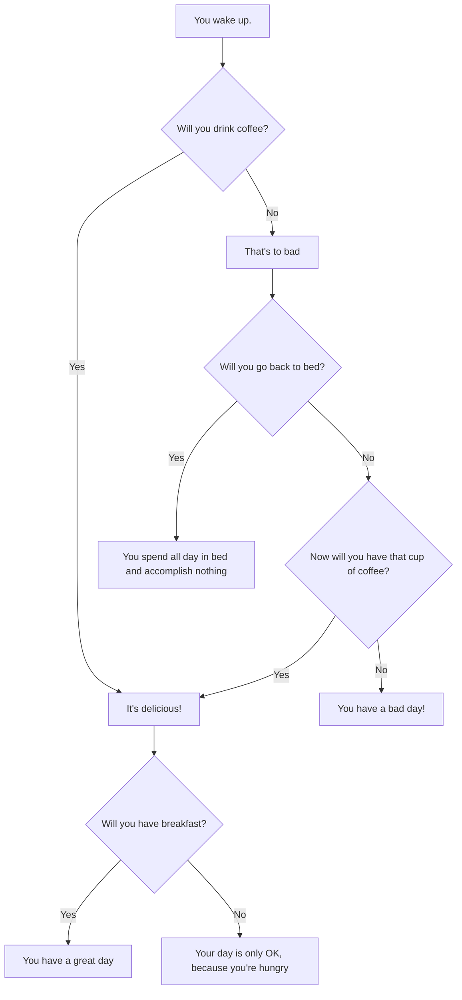

#### This choose your own adventure style flowchart shows the importance of starting your day right
From this chart we can determine the following
 - Coffee makes your day better.  
 - Breakfest makes your day better.  
 - Not having one or the other makes it worse.  
 - Missing both is disaterous.  
